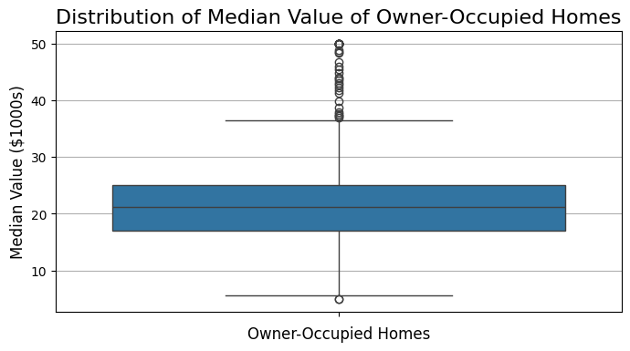
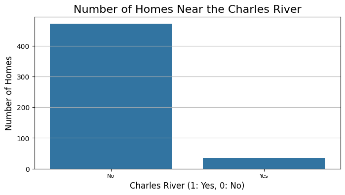
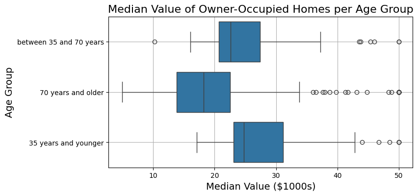
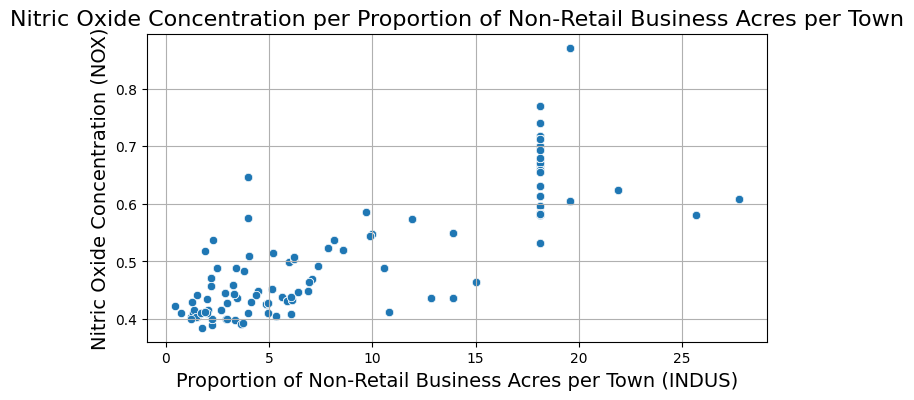
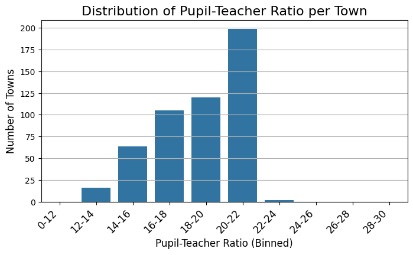

# Boston Housing Insights

## Project Scenario
 I am a Data Scientist with a housing agency in Boston MA, I have been given access to a previous dataset on housing prices derived from the U.S. Census Service to present insights to higher management. Based on my experience in Statistics, what information can I provide them to help with making an informed decision? Upper management will like to get some insight into the following.

1) Is there a significant difference in the median value of houses bounded by the Charles river or not?
2) Is there a difference in median values of houses of each proportion of owner-occupied units built before 1940?
3) Can we conclude that there is no relationship between Nitric oxide concentrations and the proportion of non-retail business acres per town?
4) What is the impact of an additional weighted distance to the five Boston employment centres on the median value of owner-occupied homes?

## Table of Contents
1. [Introduction](#introduction)
2. [Data Analysis Methodology](#data-analysis-methodology)
3. [Visualizations](#visualizations)
4. [Results Summary](#results-summary)
5. [Conclusions](#conclusions)

## Introduction
The dataset provides information on various attributes affecting housing prices in Boston, including proximity to the Charles River, age of housing units, nitric oxide concentrations, and distance to employment centers. This analysis aims to uncover insights that can inform strategic decisions related to housing development and investment.

## Data Analysis Methodology
### Statistical Tests Used
1. **T-Test**: To determine differences in median housing values for properties bounded by the Charles River.
2. **ANOVA**: To examine variations in median housing values across different proportions of owner-occupied units built before 1940.
3. **Pearson Correlation**: To assess relationships between nitric oxide concentrations and the proportion of non-retail business acres per town.
4. **Simple Linear Regression**: To quantify the impact of distance to employment centers on median housing values.

### Tools and Libraries
- Python (pandas, numpy, matplotlib, seaborn)
- Jupyter Notebook for data exploration and visualization
- Statsmodels and scipy for statistical analysis

## Visualizations
### Boxplot: Distribution of median value by owner occupied homes

### Barplot: Median Housing Values by Charles River Boundedness

### Boxplot: Median Housing Values by Age

### Scatterplot: Nitric Oxide Concentration vs Non-Retail Business Acres

### Histogram: histogram_pupil_to_teacher_ratio

## Results Summary
### Question 1: Impact of Charles River on Housing Prices
- The T-test revealed a significant difference (p < 0.05) in median housing values between properties bounded and not bounded by the Charles River. Properties near the river have higher median values, suggesting premium pricing for riverfront locations.

### Question 2: Age of Housing Units and Property Values
- ANOVA results showed significant variations (p < 0.05) in median housing values across different proportions of owner-occupied units built before 1940. Properties with higher proportions of older units tend to have lower median values, indicating potential opportunities for renovation and redevelopment.

### Question 3: Nitric Oxide and Non-Retail Business Acres
- Pearson correlation analysis indicated a moderate negative correlation (-0.38) between nitric oxide concentrations (NOX) and the proportion of non-retail business acres (INDUS) per town. However, the correlation was not statistically significant (p > 0.05), suggesting other factors influencing air quality in residential areas.

### Question 4: Distance to Employment Centers and Property Values
- Simple linear regression demonstrated a significant negative relationship (p < 0.05) between distance to Boston employment centers (DIS) and median housing values. As distance increases, median property values tend to decrease, highlighting the importance of accessibility to employment hubs in property pricing.

## Conclusions
Based on the comprehensive analysis:
- Properties near the Charles River command higher median values, indicating premium pricing for waterfront locations.
- Older housing units tend to have lower median values, suggesting opportunities for redevelopment and modernization.
- While there is a correlation between industrial zoning and air quality indicators like nitric oxide, other factors may also contribute to environmental conditions.
- Proximity to employment centers significantly affects housing prices, emphasizing the importance of accessibility in urban planning and development.

---
